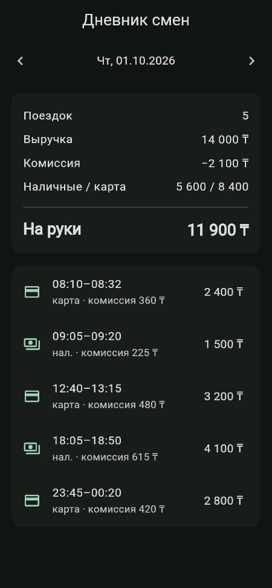

# Дневник смен водителя

Сервер на **FastAPI** и мобильное приложение на **Flutter**: сводка за день (поездки, выручка, комиссия, «на руки», наличные/карта), список поездок, переключение дней, добавление поездки через API с проверкой данных и защитой от дублей.

| 1 октября | 2 октября |
|---|---|
|  |  |

## Запуск

**Сервер** (нужен Docker):

```bash
docker compose up --build
```

API поднимется на `http://localhost:8000`, при старте загрузит поездки из [`data/trips.json`](data/trips.json). Документация API: `http://localhost:8000/docs`.

**Приложение** (нужен Flutter 3.x):

```bash
cd mobile
flutter run                                                    # iOS-симулятор / устройство
flutter run --dart-define=API_BASE_URL=http://10.0.2.2:8000    # Android-эмулятор
flutter run -d chrome                                          # в браузере
```

**Тесты:**

```bash
cd backend && python -m venv .venv && .venv/bin/pip install -r requirements-dev.txt && .venv/bin/pytest
cd mobile && flutter test
```

Те же проверки и smoke-тест Docker-контейнера запускаются в GitHub Actions на каждый push ([`.github/workflows/ci.yml`](.github/workflows/ci.yml)).

## API

| Метод | Путь | Что делает |
|---|---|---|
| `GET` | `/api/days` | Дни, в которые были поездки, от новых к старым |
| `GET` | `/api/days/{YYYY-MM-DD}` | Сводка и список поездок за день |
| `POST` | `/api/trips` | Добавить поездку |

Ответы `POST /api/trips`:

- `201` — поездка создана;
- `200` — такая поездка уже есть (повторная отправка), ничего не изменилось;
- `409` — `id` уже занят поездкой с **другими** данными; в ответе — сохранённая версия;
- `422` — данные не прошли проверку.

## Решения и почему

**Защита от дублей.** Ключ идемпотентности — `id` поездки (PRIMARY KEY). Вставка идёт через `INSERT … ON CONFLICT (id) DO NOTHING`: это одна атомарная операция, поэтому даже параллельные запросы с одним `id` создают ровно одну запись (есть тест на 16 одновременных запросов). Повтор с теми же данными возвращает `200` и сохранённую поездку, поэтому клиент может безопасно повторять запрос после обрыва связи. Тот же `id` с другими данными — это не повтор, а ошибка клиента, поэтому `409`, а не тихая перезапись.

**Какому дню принадлежит поездка.** Дню, в который она **началась**, по местному времени водителя (UTC+5, единый пояс Казахстана с 2024 года; настраивается через `DIARY_UTC_OFFSET_HOURS`). Поэтому поездка 23:45–00:20 считается в выручку того дня, когда водитель её взял, а поездка, пришедшая с временем в UTC (`2026-09-30T19:30:00Z`), попадает в 1 октября. Время без часового пояса отклоняется: «08:10» без пояса неоднозначно.

**Деньги** хранятся и считаются в целых тенге (`int`), без `float`. Сумма с копейками, строка вместо числа или комиссия больше суммы поездки — `422`.

**Проверки данных:** сумма > 0, окончание позже начала, комиссия от 0 до суммы поездки, способ оплаты только `cash`/`card`, лишние поля запрещены. Те же ограничения продублированы в схеме SQLite (`CHECK`) как вторая линия защиты.

**Время на клиенте** показывается так, как его прислал сервер (в поясе водителя), а не в поясе телефона: у водителя с телефоном в другом поясе время поездок не «съезжает».

**Быстрое переключение дней.** Если водитель быстро листает дни, ответ по старому дню может прийти позже нового. Клиент показывает ответ, только если за это время не начался более новый запрос (есть widget-тест).

**Импорт из JSON** идемпотентен: перезапуск сервера не создаёт дублей, некорректные записи пропускаются с предупреждением в логе.

## Структура

```
backend/
  app/models.py       модели и проверка данных (Pydantic)
  app/summary.py      расчёт сводки — чистая функция
  app/repository.py   SQLite, идемпотентная вставка, границы дня
  app/main.py         HTTP API и импорт JSON
  tests/              31 тест: сводка, дубли, часовые пояса, валидация, импорт
mobile/
  lib/                экран дня, API-клиент, форматирование
  test/               8 тестов: форматирование, экран, устаревшие ответы, ошибки сети
data/trips.json       пример данных
```

## Что бы добавил дальше

- Экран добавления поездки в приложении (сейчас — через API).
- Офлайн-кэш последнего загруженного дня на телефоне.
- PostgreSQL вместо SQLite и миграции (Alembic), если нужно больше одного экземпляра сервера.
- Авторизация водителя: сейчас все поездки общие.
